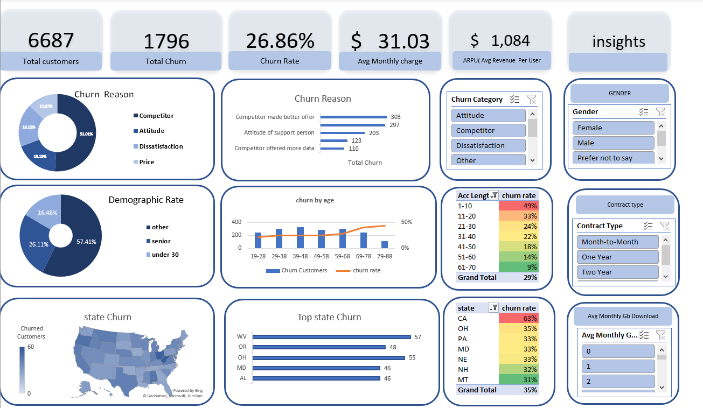

# 📊 Databel Customer Churn Dashboard



## 🧩 Project Overview
This project analyzes **customer churn data** for Databel Telecom, focusing on identifying key factors that influence customer attrition.  
An interactive dashboard was developed using **Microsoft Excel / Power BI** to visualize insights such as churn rate, customer demographics, contract types, and churn reasons.

The goal is to help business teams quickly identify **high-risk customer segments** and design effective **retention strategies**.

---

## 🗂️ Dataset
The dataset contains information about 6,687 customers, including:
- Account demographics
- Service usage metrics
- Customer service interactions
- Churn labels and reasons

| Metric | Value |
|--------|--------|
| **Total Customers** | 6,687 |
| **Total Churn** | 1,796 |
| **Churn Rate** | 26.86% |
| **Avg. Monthly Charge** | \$31.03 |
| **ARPU (Avg. Revenue per User)** | \$1,084 |

---

## 📈 Dashboard Insights

### 🔹 Churn Reasons
- **51%** of churns were due to competitors offering better deals.
- **18%** due to **attitude of support staff**.
- **18%** due to **service dissatisfaction**.
- **13%** due to **pricing issues**.

### 🔹 Demographics
- **57%** of churners fall into the “Other” demographic group.
- **26%** are **seniors**, and **16%** are **under 30**.

### 🔹 Account Length vs Churn
| Account Length (Months) | Churn Rate |
|--------------------------|-------------|
| 1–10 | 49% |
| 11–20 | 33% |
| 21–30 | 24% |
| 31–40 | 22% |
| 41–50 | 18% |
| 51–60 | 14% |
| 61–70 | 9% |

📍 **Insight:** Early-tenure customers (first 10 months) are at the **highest churn risk (49%)**.

### 🔹 Contract Type
- **Month-to-Month** customers have the **highest churn rate**.
- **One-Year** and **Two-Year** contract holders are significantly more stable.

### 🔹 Geography
Top states by churn:
| State | Churn Count | Churn Rate |
|--------|--------------|-------------|
| CA | 57 | 63% |
| OH | 48 | 35% |
| PA | 55 | 33% |
| MD | 46 | 33% |
| AL | 46 | 31% |

---

## 🧠 Key Takeaways
- **Competitor activity** is the primary churn driver.
- **Short-tenure** and **month-to-month** users are high risk.
- **Service quality and support attitude** are significant churn factors.
- **Retention programs** should target customers in their first year and those with **high monthly charges but low usage**.

---

## ⚙️ Tools & Technologies
- **Excel / Power BI** — Dashboard development and visualization  
- **Python (Pandas, Matplotlib)** — Data cleaning, analysis, and feature engineering  
- **NumPy** — Numerical computations  
- **EDA** — Exploratory Data Analysis to detect churn patterns  

---

## 🚀 How to Use
1. Clone this repository:
   ```bash
   git clone https://github.com/<your-username>/databel-churn-dashboard.git
